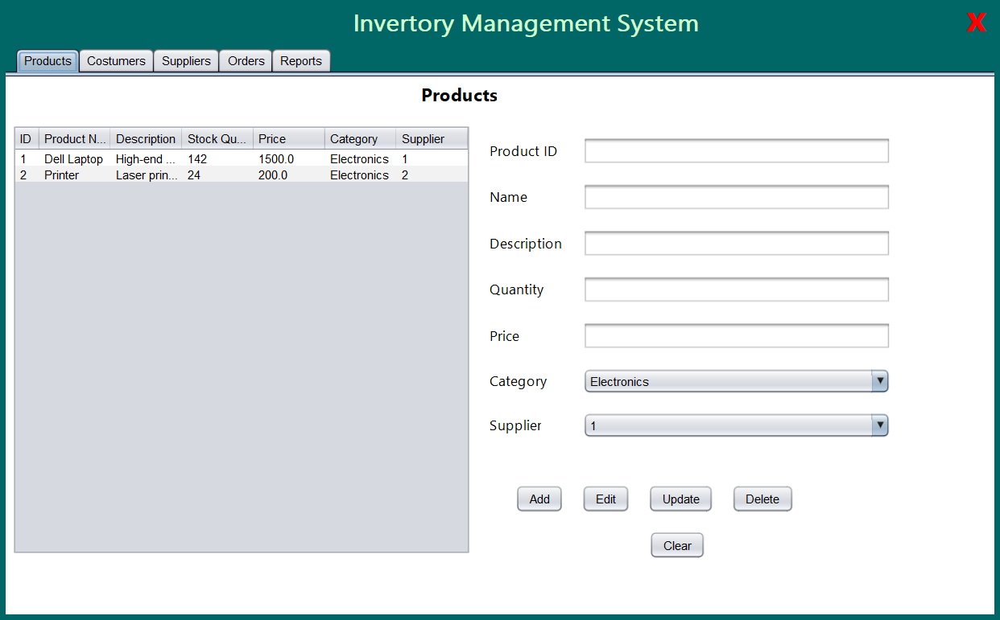
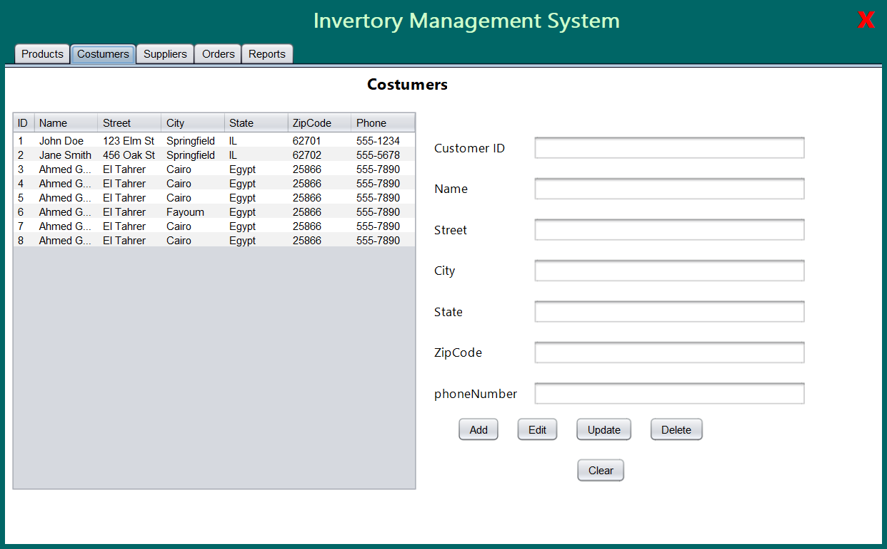
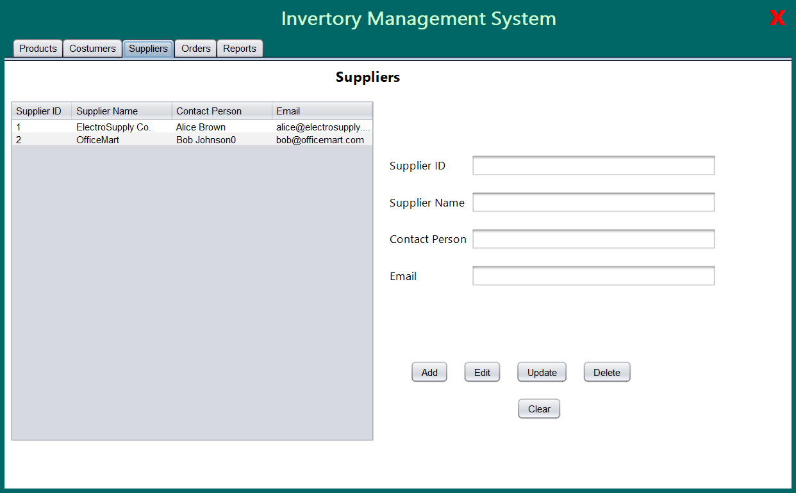
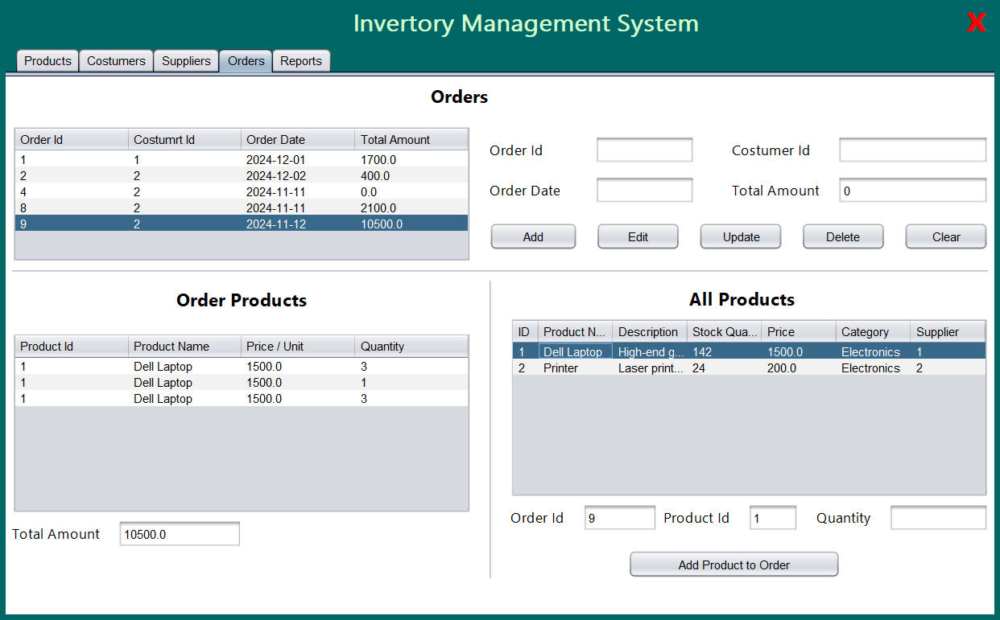

# Inventory Management System

This **Inventory Management System** is a desktop application built using **Java**, **JFrame**, and **MS SQL Server**. The system helps businesses efficiently manage their products, stock levels, suppliers, and orders. It incorporates design patterns and follows the SOLID principles for a robust and maintainable architecture.

---

## Features

### **Product Management**
- Add, update, and delete product information.
- Dynamically create product objects based on selected categories (e.g., Electronics, Furniture, Groceries).

### **Stock Tracking**
- Monitor stock levels in real time.
- Centralized inventory updates using the Singleton pattern.

### **Supplier Management**
- Add, update, and manage supplier information.
- Dynamically create supplier objects with specific properties based on types (e.g., Local, International).

### **Reporting Module**
- Generate sales reports and inventory status summaries.
- Ensure a single instance of the reporting module for consistency.

### **Order Management**
- Track orders and their statuses.
- Monitor supplier deliveries and order fulfillment timelines.

### **Design Patterns**
- **Singleton Pattern**: Used for the Stock Management System and Reporting Module.
- **Factory Pattern**: Applied to create product and supplier objects dynamically.
- **Abstract Classes**: Implemented for product categories and supplier types to ensure scalability for future requirements.

---

## Prerequisites

- **Java JDK 8+**
- **MS SQL Server**
- **Apache Ant** (for building the project)

---

## Installation

1. **Clone the repository**:
   ```bash
   git clone https://github.com/ahmedaborayya/InventoryManagmentSystem.git
   ```

2. **Navigate to the project directory**:
   ```bash
   cd InventoryManagmentSystem
   ```

3. **Set up the database**:
   - Import the provided database schema from the `database/` directory into your MS SQL Server.

4. **Build the project**:
   - Open the project in your preferred Java IDE (e.g., NetBeans, Eclipse, IntelliJ IDEA).
   - Use **Apache Ant** to build the project.

5. **Configure the database connection**:
   - Update the database connection string in the configuration file `src/config/db_config.properties` with your credentials.

6. **Run the application**:
   - Execute the main class to start the application.

---

## Usage

1. Launch the application.
2. Log in using the default credentials (if any are provided) or create a new user.
3. Use the intuitive interface to manage:
   - Products and categories
   - Suppliers and order tracking
   - Inventory and stock levels
4. Generate reports for stock and sales analysis as needed.

---

## Contributing

Contributions are welcome! If you'd like to improve this project, please follow these steps:

1. Fork the repository.
2. Create a new branch for your feature or bugfix.
3. Commit your changes.
4. Push the branch to your forked repository.
5. Open a pull request explaining your changes.

---

## License

This project is licensed under the **MIT License**. See the [LICENSE](LICENSE) file for more details.

---

## Contact

For questions, feedback, or collaboration, feel free to reach out:
- **GitHub**: [ahmedaborayya](https://github.com/ahmedaborayya)
- **Email**: aahmedaboraya@gmail.com

---

### Screenshots 
### Products


### Costumers


### Supplers


### Orders

---

Thank you for using the **Inventory Management System**! Your feedback is highly appreciated.
